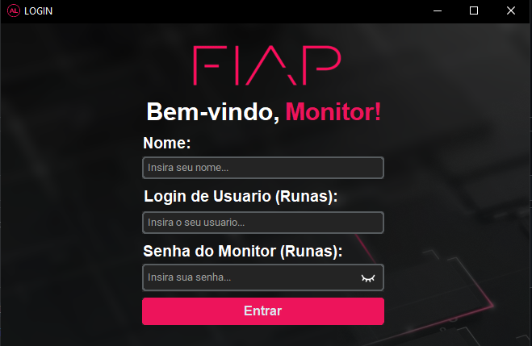

<div>
  
</div>

## 📜 Descrição

O FIAP Autolab é um software de automação criado para facilitar o dia a dia dos monitores. Através da implementação de scripts com Python e uma Interface Gráfica que utiliza a biblioteca CustomTkinter, buscamos otimizar tarefas repetitivas, melhorar a organização e aumentar a eficiência no acompanhamento e na execução de comandos do CMD comuns utilizados dentro da instituição.

## 👨🏻‍💻 Criadores
- Victor Flávio Demarchi Viana
- Ryan Brito Pereira Ramos
<div style="display: flex;">
 <a href="https://www.linkedin.com/in/victor-fl%C3%A1vio/"></a>
 <a href="https://www.linkedin.com/in/ryanbritodev"></a>
</div>

## 🤔 Como funciona?

Este projeto foi desenvolvido para facilitar e automatizar tarefas do dia a dia dos monitores, aproveitando o poder dos scripts .bat para executar comandos do CMD de forma prática e eficiente.

### 1. Execução Automatizada de Scripts
O sistema é capaz de executar arquivos .bat que contêm scripts pré-configurados para diversas operações, como:

- Desligar e reiniciar máquinas;
- Apagar e copiar arquivos;
- Enviar mensagens para usuários;
- Logar automaticamente em sistemas;
- Entre outras tarefas essenciais.

### 2. Interface Intuitiva
A interface foi projetada para tornar a execução desses scripts simples e acessível, mesmo para quem não possui conhecimentos nos comandos do CMD.

### 3. Customização de Scripts
Os usuários podem personalizar os scripts .bat com parâmetros conforme suas necessidades específicas, garantindo flexibilidade e eficiência no uso da ferramenta.

### 4. Automação e Economia de Tempo
Com a automação, tarefas que antes precisavam ser realizadas manualmente agora podem ser feitas com um único clique, economizando tempo e reduzindo erros operacionais.

### 5. Segurança e Controle
O uso do sistema garante que as operações sejam realizadas de maneira segura, controlada e criptografada, minimizando acessos indevidos.

## 📁 Instalação
### Pré-requisitos

Para começar, certifique-se de atender aos seguintes requisitos:
- Hardware: Pen Drive com BitLocker ativo.
- Sistema Operacional: Windows (requer CMD para a execução dos scripts).
- Python: Já incluso no ambiente configurado no projeto.

## 💾 Ativando o BitLocker no Pen Drive


### Passo a Passo
- Clone o repositório do projeto na raíz do seu Pen Drive com o BitLocker ativo.
- No terminal, execute o comando:

```bash
git clone -b Program https://github.com/ryanbritodev/autolab.git
```

### Configuração da Estrutura do Projeto
- Mantenha a pasta bats-fiap na raiz do drive (ex.: E:\bats-fiap).
- Certifique-se de manter o arquivo AutoLab.vbs na mesma pasta.

## 📂 Estrutura do Projeto

```plaintext
autolab/
│
├── ajuda/              # Documentação para suporte ao usuário
├── autolab/            # Pacotes com funções do Autolab
├── project/            # Diretório com código-fonte principal
├── scripts/            # Scripts e credenciais
│
├── .gitignore          # Arquivo para controle de versionamento
├── AutoLab.vbs         # Script para inicialização do Autolab
├── LICENSE             # Licença do projeto
├── README.md           # Documentação do projeto
└── venv.zip            # Ambiente virtual compactado do Python (com todas as dependências)
```

### Configuração do Ambiente Virtual
- Extraia o conteúdo do arquivo venv.zip dentro da pasta bats-fiap.

### Ajustes de Nomenclatura
- Se for necessário renomear a pasta bats-fiap, atualize o nome no arquivo AutoLab.vbs.

## 🚀 Como Usar
Inicializar o Software
- Clique duas vezes no arquivo AutoLab.vbs para iniciar a aplicação.
- Preencha suas credenciais no campo de Login.



### Executar Scripts
- Escolha as tarefas disponíveis na interface e clique no botão correspondente para executar!

## 📞 Suporte
Caso tenha dúvidas ou sugestões, entre em contato com os criadores ou consulte o diretório [ajuda](https://github.com/ryanbritodev/autolab/tree/LabLogins/ajuda) para saber mais sobre.

### Agradecemos por usar o FIAP Autolab e contribuir para um ambiente de aula mais produtivo! 🚀
